# Complete Installation Procedure for Project Gorgeous (client) (English)

> ℹ️ **Important Note Before You Begin:** It is strongly advised to read this entire document carefully at least once before starting the installation. Follow the steps in order and do not skip any to avoid potential issues. Finally, pay close attention to the "ℹ️ **Note**" and "⚠️ **WARNING**" information throughout the document.

## Required Specifications to Play the Modpack
Project Gorgeous is a very large modpack with around 650 mods, requiring a powerful hardware configuration to run smoothly. Here are the technical specifications needed to play Project Gorgeous:
- Recent CPU with a boost frequency of 4.4 GHz or higher
- CPU with 6 cores (or more)
- CPU with 6 threads (or more)
- 12 GB of RAM allocated to Minecraft (14 GB recommended)
- Minimum 16 GB of RAM on your PC
- SSD storage device
- Java 8 with IBM's OpenJ9 JVM installed (see installation procedure below)

> ⚠️ **WARNING:** If your hardware configuration does not meet these specifications, it is possible that the modpack will not work correctly or that you will encounter performance issues.

> ⚠️ **WARNING:** The modpack takes between **10 and 25 minutes to start**, depending on the power of your hardware configuration. **Avoid any interaction with the game window** during this time to avoid any problems. If your window is in "Not responding" mode, **don't touch anything and wait a bit**. It should return to normal shortly after.

> ℹ️ **Note :** It is recommended to launch the modpack once so that it generates the necessary files, change the settings to your liking, then close it and restart it before starting to play.

> ℹ️ **Note:** For now, the modpack has not been tested on Linux and MacOS. It is recommended to play on Windows.

## Modpack Environment Installation and Configuration Procedure

### I - Installing Java 8 OpenJ9

> ⚠️ **WARNING:** It is important to install and use the OpenJ9 version of Java 8 to launch the modpack. This specific version of Java distributed by IBM helps reduce the RAM consumption of Minecraft.

> ℹ️ **Note:** This new installation should not interfere with your current Java installation.

1. Go to the official IBM Developer website to download Java 8 OpenJ9: https://developer.ibm.com/languages/java/semeru-runtimes/downloads/?version=8&os=Windows

2. Select the following options:
   - Version: IBM Semeru Runtime Open Edition
   - Java: Java 8 (LTS)
   - Operating System: Windows
   - Architecture: x64

> ⚠️ **WARNING:** Don't forget to select the "x64" architecture in the filter drop-down list! **It is NOT selected by default!**

> ⚠️ **WARNING:** Check ALL filters carefully to avoid downloading a wrong version!

3. Choose the version labeled "Latest" and download the `.msi` file from the **JRE** line.
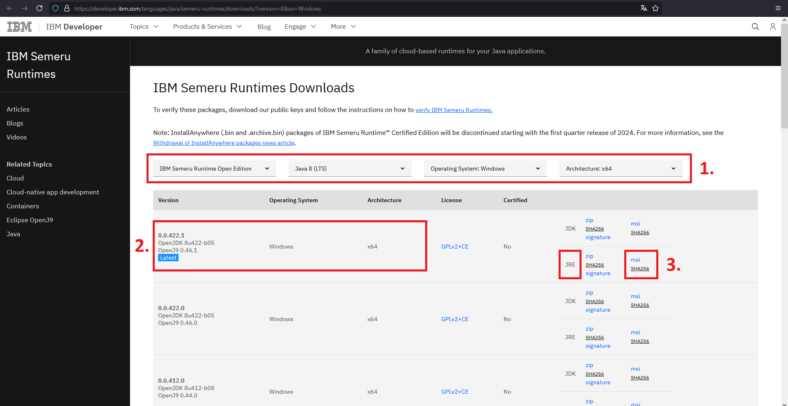

4. Run the downloaded `.msi` installation file.
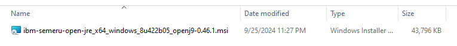

5. Follow the installer instructions to install Java 8 OpenJ9. Note the default installation path.
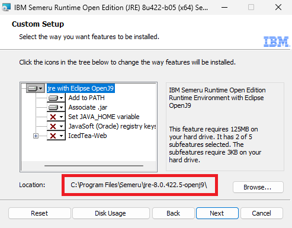

> ⚠️ **WARNING:** If the installation path is "Program Files **(x86)**", it means that you have not downloaded the 64-bit version of Java! Cancel the installation and go back to step 1 of this section, making sure to select the "x64" filter for the architecture (which is NOT selected by default).

6. Congratulations, you have installed Java 8 OpenJ9. Now we can proceed to install CurseForge.

### II - Installing CurseForge
1. Download the **Standalone** CurseForge application from the official website: https://www.curseforge.com/download/app
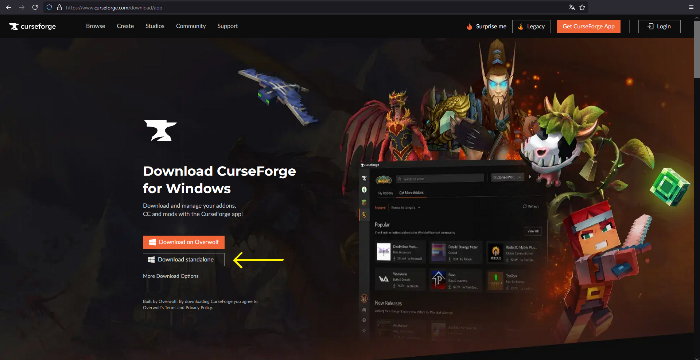

> ℹ️ **Note:** Make sure to download the **Standalone** version of CurseForge, not the Overwolf version.

2. Run the downloaded `.exe` installation file.


3. Follow the installer instructions to install CurseForge. When prompted to choose your privacy settings, you can click "Manage" and disable everything.


4. Congratulations, CurseForge is now installed. We will now proceed to configure CurseForge.

### III - Configuring CurseForge

> ⚠️ **WARNING:** It is important to follow these steps precisely for the Project Gorgeous modpack to work correctly and optimally.

1. Launch CurseForge. If you don't have an account, you can use the app without signing in by clicking "Continue as guest".


2. Select Minecraft from the list of available games.
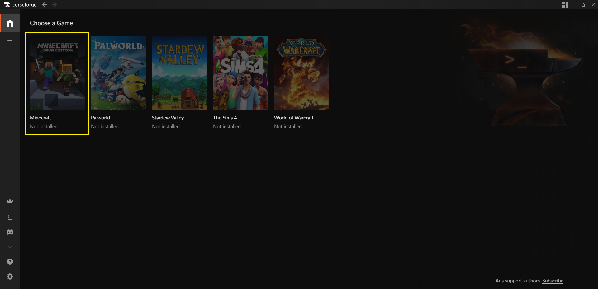

3. Select the standard installation option. The installation will occur in the folder `C:\Users\<your name>\CurseForge\Minecraft`.
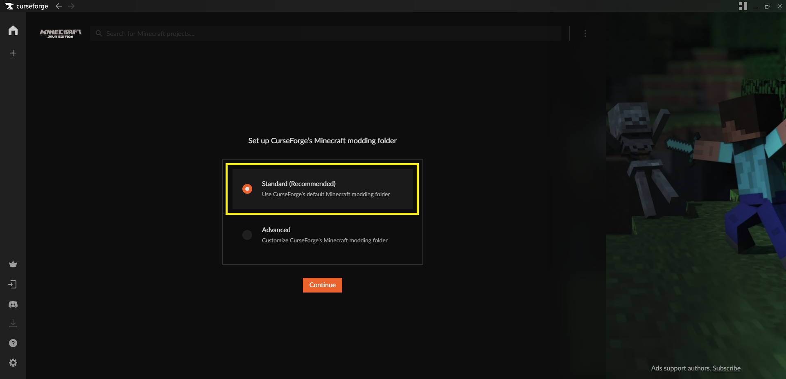
> ℹ️ **Note:** If you want to use the advanced installation option to choose the Minecraft installation folder location, you can do so. However, note that **it is recommended to place this folder on an SSD**.

4. Now go to the CurseForge app settings. To do this, click on the gear icon at the bottom left.
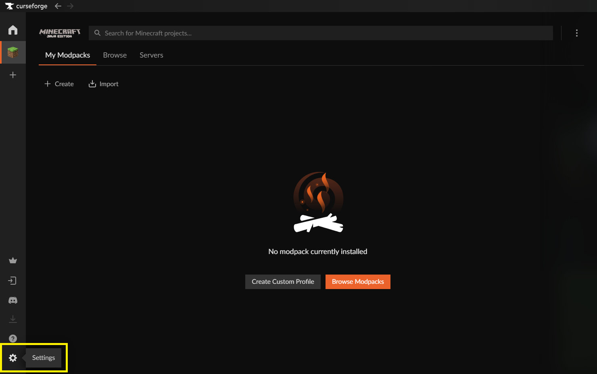

5. *Optional:* In the "Privacy" tab of the settings, you can disable the following options.
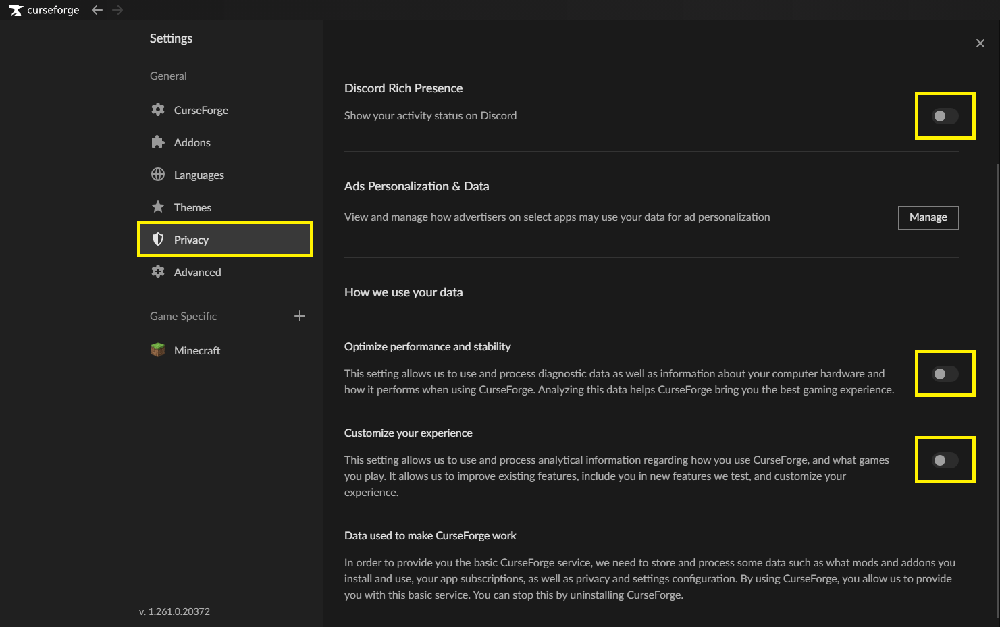

6. In the "Minecraft" tab, under "Game Resolution," make sure the game resolution is configured as you like. You can also use your screen's default resolution.


7. Still in the "Minecraft" tab, adjust the amount of RAM allocated to Minecraft. To do this, in the "Allocated Memory" section, move the RAM slider to the amount you want to allocate (1 GB = 1024 MB).

> ℹ️ **Note:** This is a global setting and will affect all your Minecraft instances on CurseForge.

> ⚠️ **WARNING:** Project Gorgeous requires **at least 12 GB** (= 12288 MB) of RAM to function properly! It is recommended to allocate **14 GB** (= 14336 MB) of RAM for optimal performance.

8. Still in the "Minecraft" tab, we will now modify the version of Java used by Minecraft. To do this, in the "Java Versions" section, click the "Choose" button on the "Java 8" line.
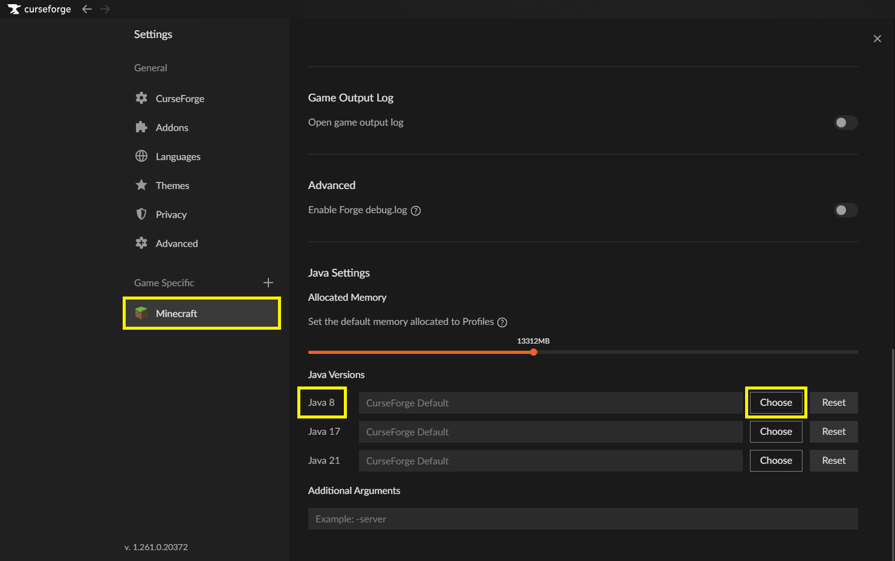

9. In the window that opens, navigate to the Java 8 OpenJ9 installation folder and the `bin` folder. The default path is: `C:\Program Files\Semeru\jre-8.0.<version number>-openj9\bin`.


10. Select the `javaw.exe` file and click "Open."
> ⚠️ **WARNING:** It is important to select the `javaw.exe` file with a **W**, not `java.exe`.

11. You should now see the Java 8 OpenJ9 path in the "Java 8" line on CurseForge.


12. Final step, in the "Additional Arguments" section, copy the following code to optimize RAM usage.
```
-Xmx12G -XX:+UnlockExperimentalVMOptions -XX:+UseG1GC -XX:G1NewSizePercent=20 -XX:G1ReservePercent=20 -XX:MaxGCPauseMillis=50 -XX:G1HeapRegionSize=32M
```
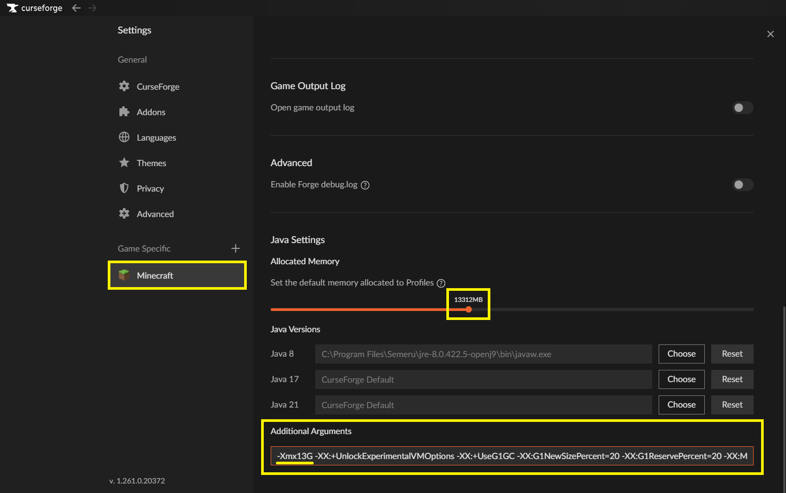
> ⚠️ **WARNING:** Don't forget to modify the first part of the text `-Xmx12G` to match the amount of RAM you allocated to Minecraft with the previous slider. For example, if you allocated 14 GB of RAM, you should change the text to `-Xmx14G`.

13. Congratulations, you have configured CurseForge to launch Project Gorgeous under optimal conditions!

## Modpack Installation Procedure

### I - Installing Project Gorgeous

1. Go to the "Minecraft" tab in CurseForge.

2. In the "Search for Minecraft projects..." search bar in CurseForge, search for "Project Gorgeous" and click on the corresponding modpack.

3. Click the "Install" button to download and install the modpack.

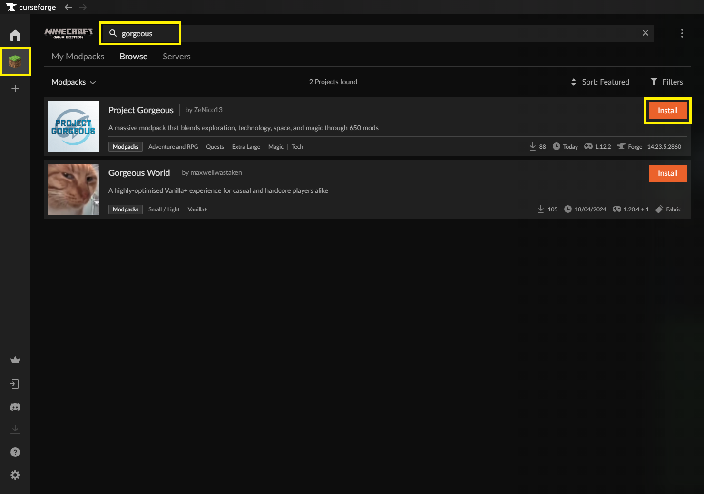

### II - Installing OptiFine

> ℹ️ **Note:** OptiFine is a mod that optimizes Minecraft performance and is not included with the modpack (for licensing reasons). However, it is highly recommended to install it for a better gaming experience.

1. Go to the official OptiFine website: https://optifine.net/downloads

2. Click on the text "Show all versions" to display all available versions.

3. Scroll down to the "Minecraft 1.12.2" category and click on the "Preview Versions" text.

4. Download the version `OptiFine HD U G6 pre1` by clicking on the download text (Mirror).

> ℹ️ **Note:** The modpack has been tested and approved only on version `OptiFine HD U G6 pre1`.

5. Once the `.jar` file is downloaded, go to your Minecraft modpacks list on CurseForge.

6. Right-click on the Project Gorgeous modpack logo, then click on the "Open Folder" option to open the modpack installation folder.


7. Drag the downloaded `OptiFine

_1.12.2_HD_U_G6_pre1.jar` file into the "mods" folder of the Project Gorgeous modpack.
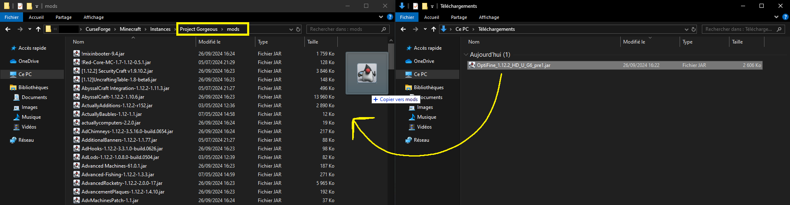

8. Congratulations, you have installed OptiFine on the modpack!

### III - Setting up Simple Voice Chat (proximity voice chat)

> ℹ️ **Note:** Simple Voice Chat is a mod already included with the modpack that allows you to add proximity voice chat in Minecraft. Here is how to set it up.

1. Launch the modpack, then go to the game options, in the controls settings.

2. Type "Chat" in the search bar to find the Simple Voice Chat keyboard shortcuts. The setting we are interested in is "Voice Chat GUI". Assign it a key that you don't use.
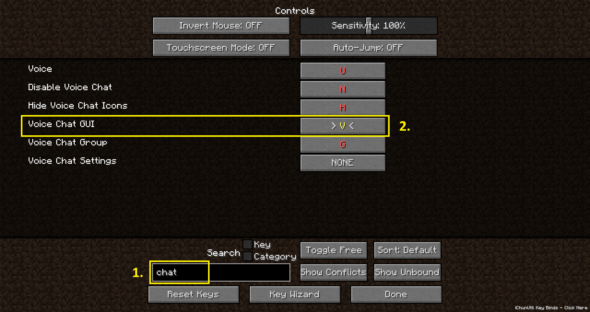

3. Connect to a server or a single player world.

4. Press the key you assigned to open the Simple Voice Chat GUI menu. Click the "Next" button.


5. Select your microphone from the list, then click the "Next" button.


6. Select your headset or speakers from the list, then click the "Next" button.
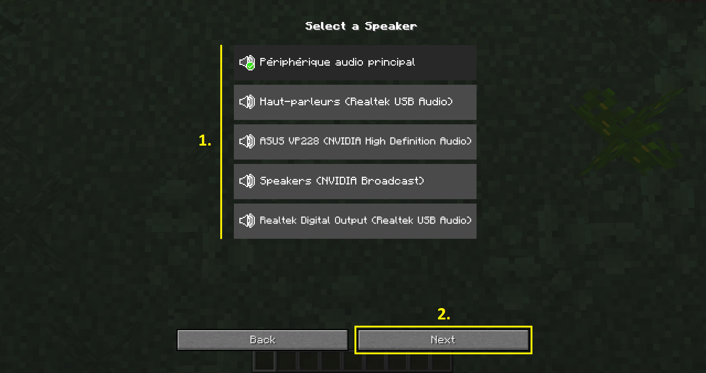

7. Select one of the 2 voice detection modes. Configure the microphone sensitivity and amplification if necessary. Then click on the "Next" button.


8. Complete the setup by clicking the "Finish setup" button.
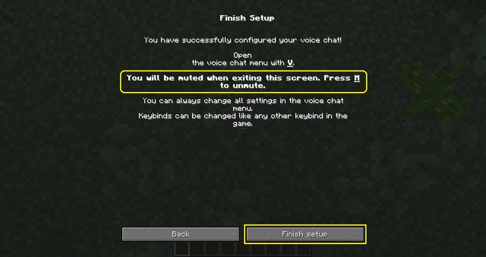

9. Once you have completed these steps, press the key you assigned again to open the Simple Voice Chat GUI menu. Unmute your microphone by clicking the "Mute" button.


10. Congratulations, you have configured Simple Voice Chat!

## Launching Project Gorgeous

Once all these steps are completed, you are ready to play Project Gorgeous!

I wish you an amazing adventure in Project Gorgeous! Have fun! 🌟
