# Procédure d'installation complète de Project Gorgeous (client) (Français)

> ℹ️ **Note importante d'avant propos :** Il est fortement conseillé de lire l'intégralité de ce document attentivement une première fois avant de commencer l'installation. Suivez les étapes dans l'ordre et n'en sautez pas pour éviter tout problème. Enfin, prenez bien en considération les informations "ℹ️ **Note**" et "⚠️ **ATTENTION**" tout au long du document.

## Spécifications requises pour jouer au modpack
Project Gorgeous est un très gros modpack d'environ 650 mods, et nécessite donc une configuration matérielle assez puissante pour fonctionner correctement. Voici les spécifications techniques nécessaires pour jouer à Project Gorgeous :
- CPU récent avec une fréquence de boost de 4,4 GHz ou plus
- CPU avec 6 cœurs ou plus
- CPU avec 6 threads ou plus
- 12 Go de RAM allouée à Minecraft (14 Go recommandés)
- Minimum 16 Go de RAM sur votre PC
- Un stockage SSD
- Java 8 avec la JVM OpenJ9 d'IBM installé (voir la procédure d'installation ci-dessous)

> ⚠️ **ATTENTION :** Si votre configuration matérielle ne correspond pas à ces spécifications, il est possible que le modpack ne fonctionne pas correctement ou que vous rencontriez des problèmes de performances.

> ⚠️ **ATTENTION :** Le modpack prend entre **15 et 30 minutes pour démarrer**, en fonction de la puissance de votre configuration matérielle. **Évitez toute interaction avec la fenêtre du jeu** pendant ce temps pour éviter tout problème. Si votre fenêtre est en mode "Ne répond pas", **ne touchez à rien et attendez un peu**. Cela devrait revenir à la normale peu de temps après.

> ℹ️ **Note :** Pour le moment, le modpack n'a pas été testé sur Linux et MacOS. Il est recommandé de jouer sur Windows.

> ℹ️ **Note :** Il est recommandé de lancer une première fois le modpack pour qu'il génère les fichiers nécessaires, de modifier les paramètres à votre convenance, puis de le fermer et de le relancer avant de commencer à jouer.

## Procédure d'installation et de configuration de l'environnement du modpack

### I - Installation de Java 8 OpenJ9

> ⚠️ **ATTENTION :** Il est important d'installer et d'utiliser la version OpenJ9 de Java 8 pour lancer le modpack. Cette version particulière de Java distribuée par IBM permet de réduire la consommation de RAM de Minecraft.

> ℹ️ **Note :** Cette nouvelle installation ne devrait pas interférer avec votre installation Java actuelle.

1. Rendez-vous sur le site officiel d'IBM Developer pour télécharger Java 8 OpenJ9 : https://developer.ibm.com/languages/java/semeru-runtimes/downloads/?version=8&os=Windows

2. Sélectionnez les options suivantes :
   - Version : IBM Semeru Runtime Open Edition
   - Java : Java 8 (LTS)
   - Operating System : Windows
   - Architecture : x64

> ⚠️ **ATTENTION :** N'oubliez pas de sélectionner l'architecture "x64" dans la liste déroulante des filtres ! **Elle n'est PAS sélectionnée par défaut !**

> ⚠️ **ATTENTION :** Vérifiez bien TOUS les filtres pour ne pas télécharger une mauvaise version !

3. Prenez la version étiquetée "Latest" et téléchargez le fichier `.msi` de la ligne **JRE**.
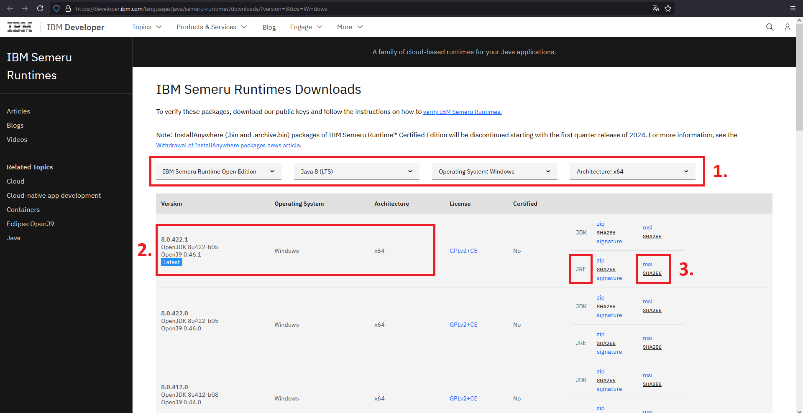

4. Exécutez le fichier d'installation `.msi` téléchargé.
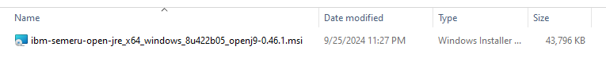

5. Suivez les instructions de l'installateur pour installer Java 8 OpenJ9. Notez le chemin d'installation par défaut.
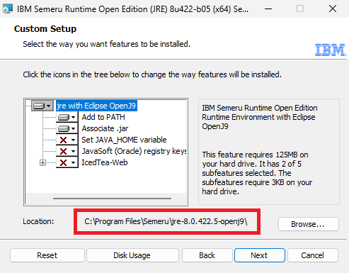

> ⚠️ **ATTENTION :** Si le chemin d'installation est "Program Files **(x86)**", c'est que vous n'avez pas téléchargé la version 64 bits de Java ! Annulez l'installation et revenez à l'étape 1 de cette section en faisant bien attention de sélectionner le filtre "x64" pour l'architecture (qui n'est PAS sélectionné par défaut).

6. Félicitations, vous avez installé Java 8 OpenJ9. Nous pouvons maintenant passer à l'installation de CurseForge.

### II - Installation de CurseForge
1. Télécharger l'application CurseForge **Standalone** depuis le site officiel : https://www.curseforge.com/download/app
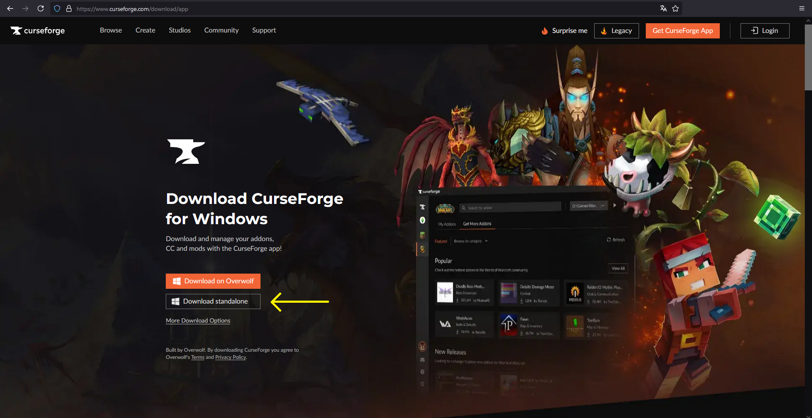

> ℹ️ **Note :** Téléchargez bien la version **Standalone** de CurseForge, et non la version Overwolf.

2. Exécutez le fichier d'installation `.exe` téléchargé.
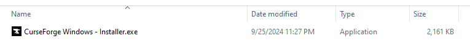

3. Suivez les instructions de l'installateur pour installer CurseForge. Au moment où il faut choisir ses options de confidentialité, vous pouvez cliquer sur "Manage" et tout désactiver.
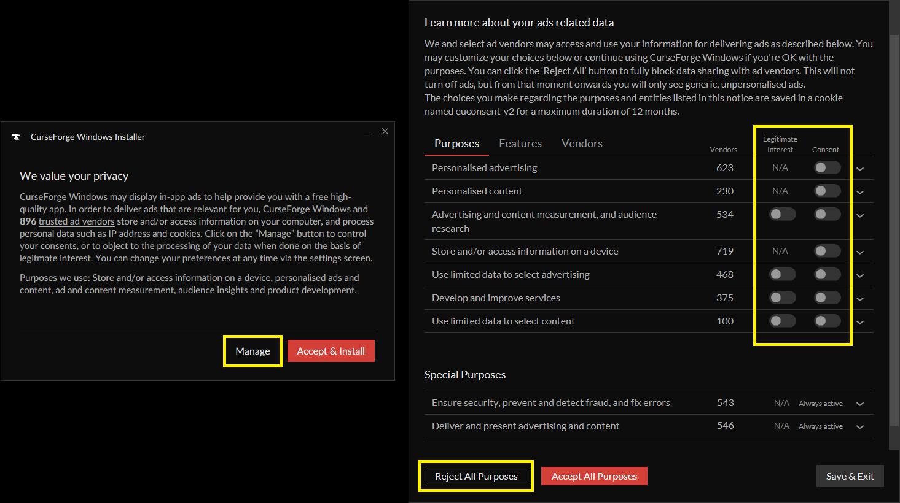

4. Félicitations, CurseForge est maintenant installé. Nous allons maintenant passer à la configuration de CurseForge.

### III - Configuration de CurseForge

> ⚠️ **ATTENTION :** Il est important de suivre ces étapes à la lettre pour que le modpack Project Gorgeous fonctionne correctement et de façon optimale.

1. Lancez CurseForge. Si vous n'avez pas de compte, vous pouvez très bien utiliser l'application sans vous connecter en cliquant sur "Continue as guest".


2. Sélectionnez le jeu Minecraft dans la liste des jeux disponibles.
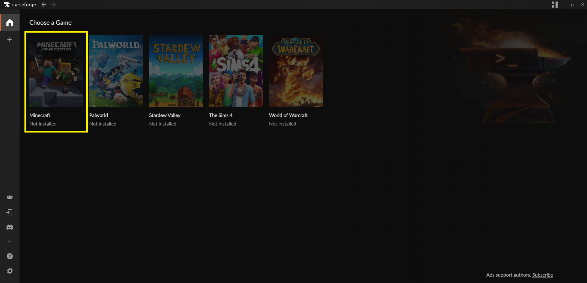

3. Sélectionnez l'option d'installation standard. L'installation s'effectuera dans le dossier `C:\Users\<votre nom>\CurseForge\Minecraft`.
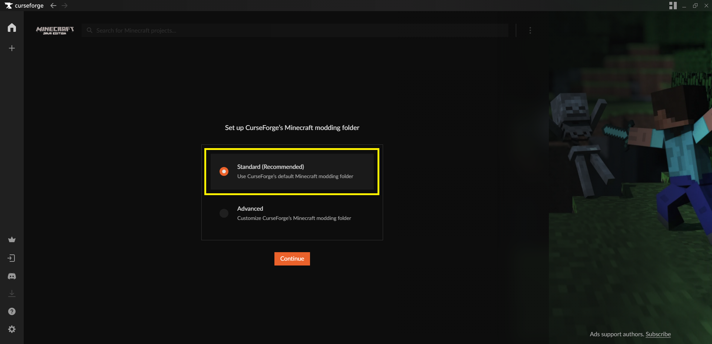
> ℹ️ **Note :** Si vous souhaitez utiliser l'option d'installation avancée pour choisir l'emplacement du dossier d'installation de Minecraft, vous pouvez le faire. Cependant, notez qu'**il est recommandé de mettre ce dossier sur un SSD**.

4. Rendez-vous maintenant dans les paramètres de l'application CurseForge. Pour cela, cliquez sur l'icône d'engrenage en bas à gauche.
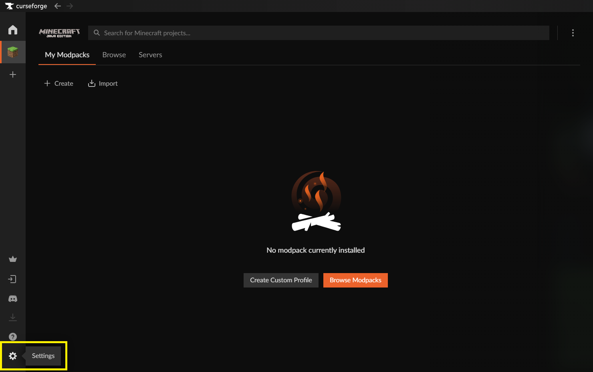

5. *Optionnel :* Dans l'onglet "Privacy" des paramètres, vous pouvez désactiver les options suivantes.
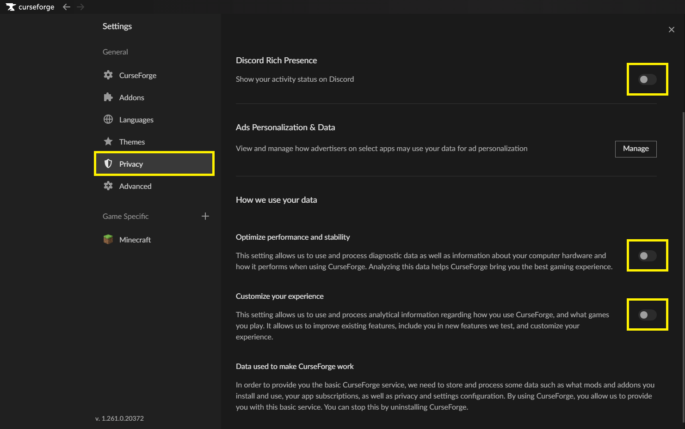

6. Dans l'onglet "Minecraft", dans la partie "Game Resolution", assurez-vous que la résolution du jeu est configurée à votre guise. Vous pouvez aussi utiliser la résolution de votre écran par défaut.
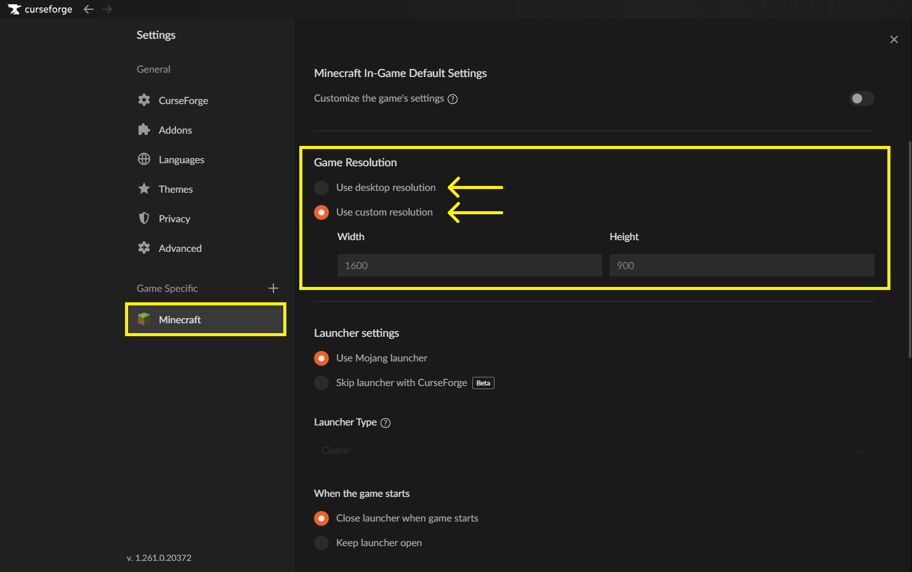

7. Toujours dans l'onglet "Minecraft", modifiez la quantité de RAM allouée à Minecraft. Pour cela, dans la partie intitulée "Allocated Memory", déplacez le slider de RAM à la quantité que vous souhaitez allouer (1 Go = 1024 Mo).
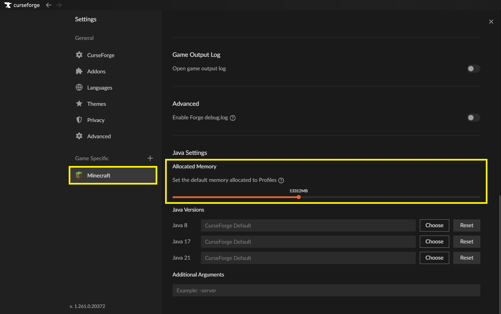
> ℹ️ **Note :** Ce paramètre est global et affectera toutes vos instances Minecraft sur CurseForge.

> ⚠️ **ATTENTION :** Project Gorgeous nécessite **au minimum 12 Go** (= 12288 Mo) de RAM pour fonctionner correctement ! Il est recommandé d'allouer **14 Go** (= 14336 Mo) de RAM pour une expérience optimale.

8. Toujours dans l'onglet "Minecraft", nous allons maintenant modifier la version de Java utilisée par Minecraft. Pour cela, dans la partie intitulée "Java Versions", cliquez sur le bouton "Choose" dans la ligne "Java 8".
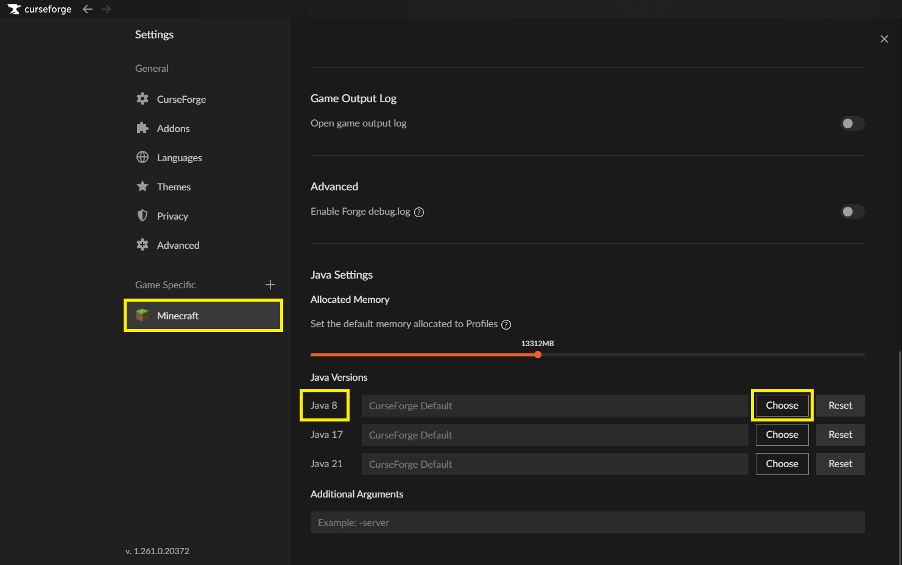

9. Dans la fenêtre qui s'ouvre, naviguez jusqu'au dossier d'installation de Java 8 OpenJ9 et dans le dossier `bin`. Par défaut, le chemin d'accès est le suivant : `C:\Program Files\Semeru\jre-8.0.<numéro de version>-openj9\bin`.
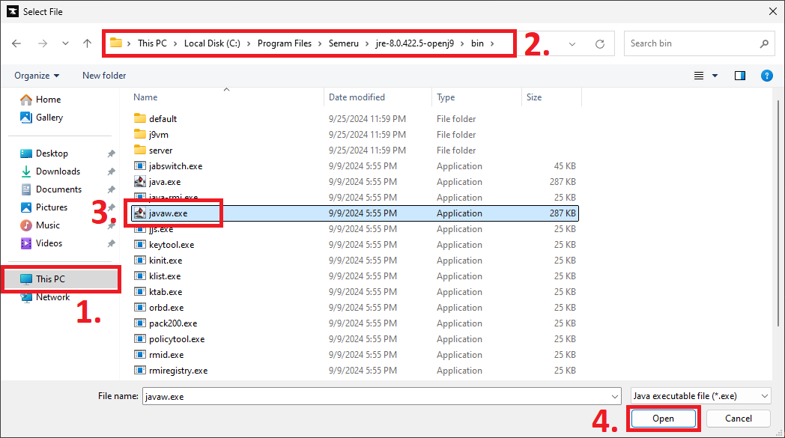

10. Sélectionnez le fichier `javaw.exe` et cliquez sur "Open".
> ⚠️ **ATTENTION :** Il est important de sélectionner le fichier `javaw.exe` avec un **W**, et non `java.exe`.

11. Vous devriez maintenant voir le chemin d'accès à Java 8 OpenJ9 dans la ligne "Java 8" sur CurseForge.
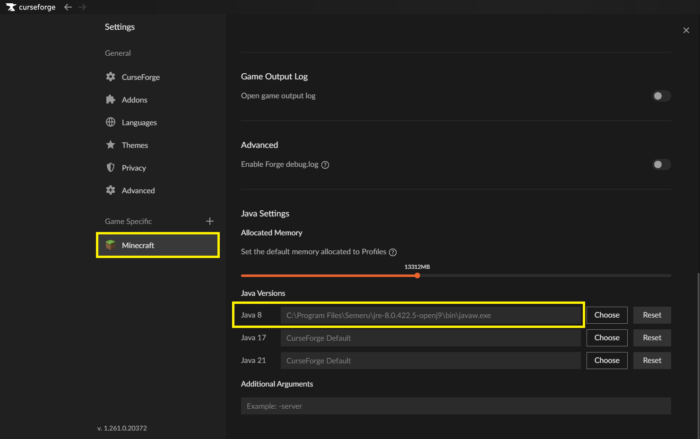

12. Dernière étape, dans la partie intitulée "Additional Arguments", copiez le code suivant afin d'optimiser l'utilisation de la RAM.
```
-Xmx12G -XX:+UnlockExperimentalVMOptions -XX:+UseG1GC -XX:G1NewSizePercent=20 -XX:G1ReservePercent=20 -XX:MaxGCPauseMillis=50 -XX:G1HeapRegionSize=32M
```
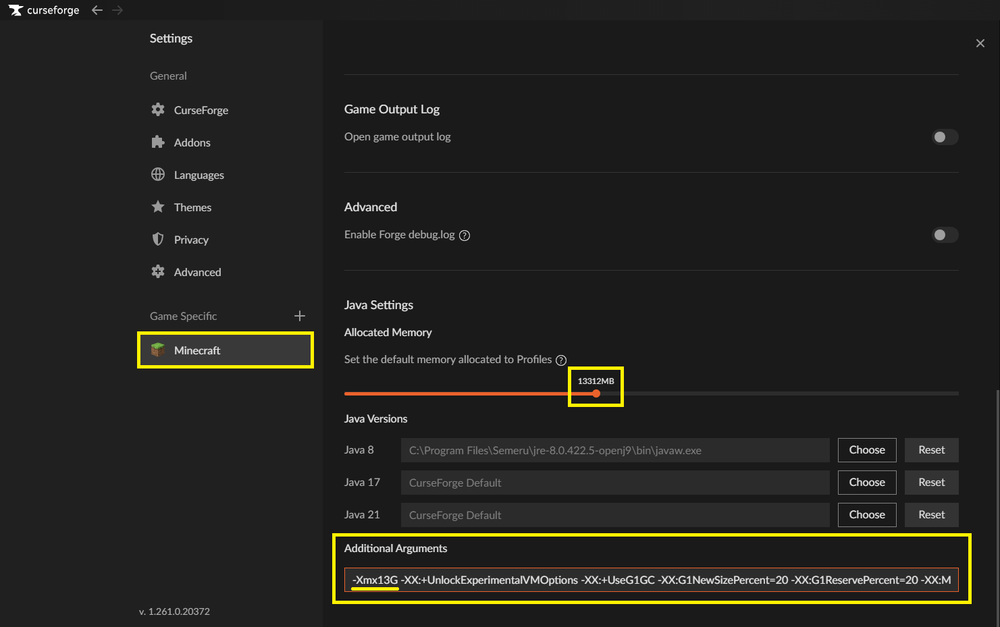
> ⚠️ **ATTENTION :** N'oubliez pas de modifier la première partie de texte `-Xmx12G` pour correspondre à la quantité de RAM que vous avez allouée à Minecraft dans le slider précédemment. Par exemple, si vous avez alloué 14 Go de RAM, vous devrez modifier le texte en `-Xmx14G`.

13. Félicitations, vous avez configuré CurseForge pour lancer Project Gorgeous dans les meilleures conditions !

## Procédure d'installation du modpack

### I - Installation de Project Gorgeous

1. Naviguez dans l'onglet "Minecraft" de CurseForge.

2. Dans la barre de recherche "Search for Minecraft projects..." de CurseForge, recherchez "Project Gorgeous" et cliquez sur le modpack correspondant.

3. Cliquez sur le bouton "Install" pour télécharger et installer le modpack.

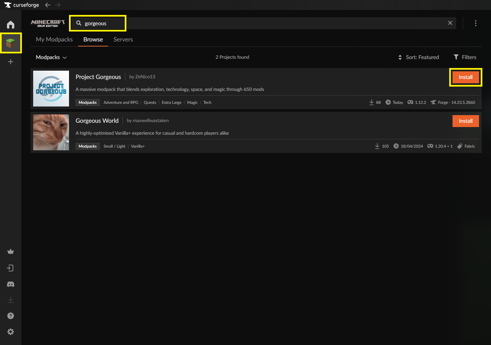

### II - Installation d'OptiFine

> ℹ️ **Note :** OptiFine est un mod qui permet d'optimiser les performances de Minecraft et n'est pas inclus de base avec le modpack (pour des raisons de licence). Cependant, il est très fortement recommandé de l'installer pour une meilleure expérience de jeu.

1. Rendez-vous sur le site officiel d'OptiFine : https://optifine.net/downloads

2. Cliquez sur le texte "Show all versions" pour afficher toutes les versions disponibles.

3. Défilez jusqu'à arriver à la catégorie "Minecraft 1.12.2" et cliquez sur le texte "Preview Versions".

4. Téléchargez la version `OptiFine HD U G6 pre1` en cliquant sur le texte de téléchargement (Mirror).
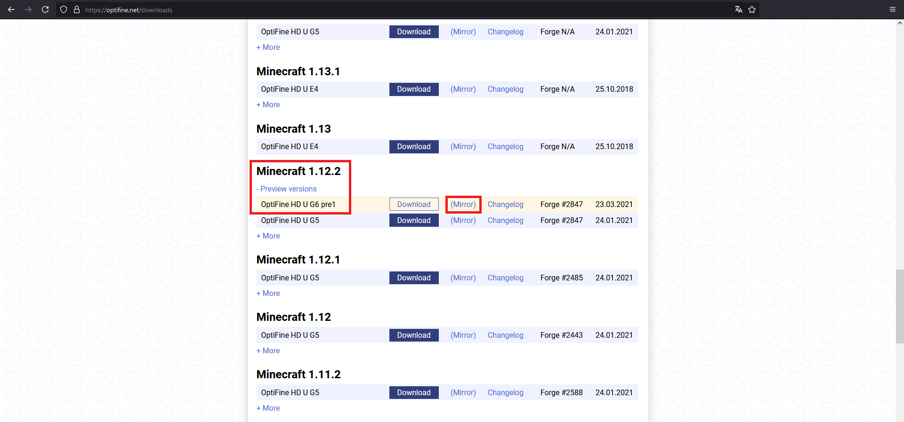
> ℹ️ **Note :** Le modpack a été testé et approuvé uniquement sur la version `OptiFine HD U G6 pre1`.

5. Une fois le fichier `.jar` téléchargé, allez dans la liste de vos modpacks Minecraft sur CurseForge.

6. Sur le modpack Project Gorgeous, faites un clic droit sur le logo, puis cliquez sur l'option "Open Folder" pour ouvrir le dossier d'installation du modpack.
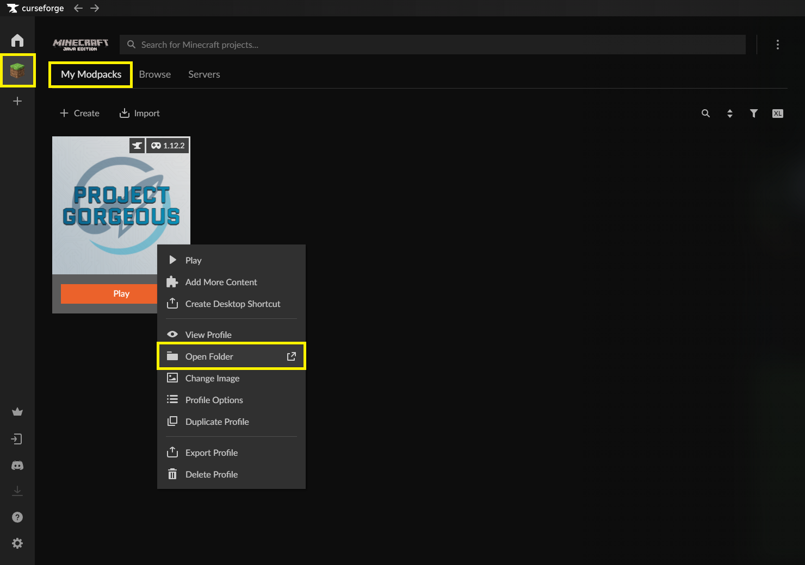

7. Glissez le fichier `OptiFine_1.12.2_HD_U_G6_pre1.jar` téléchargé dans le dossier "mods" du modpack Project Gorgeous.
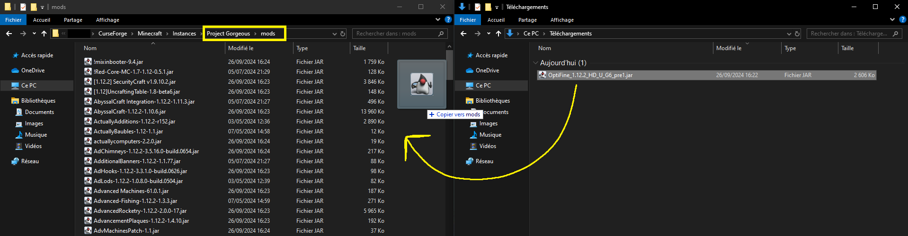

8. Félicitations, vous avez installé OptiFine sur le modpack !

### III - Mise en place de Simple Voice Chat (chat vocal de proximité)

> ℹ️ **Note :** Simple Voice Chat est un mod déjà inclus avec le modpack qui permet d'ajouter un chat vocal de proximité dans Minecraft. Voici comment le configurer.

1. Lancez le modpack, puis allez dans les options de jeu, dans les paramètres des contrôles.

2. Tapez "Chat" dans la barre de recherche pour trouver les raccourcis clavier de Simple Voice Chat. Le paramètre qui nous intéresse est "Voice Chat GUI". Assigne-lui une touche que vous n'utilisez pas.
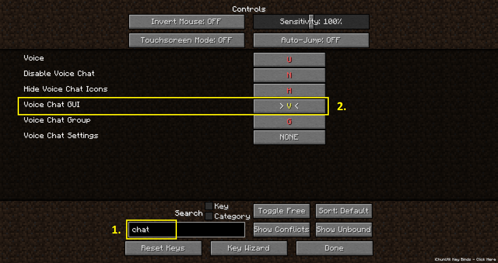

3. Connectez-vous à un serveur ou à un monde solo.

4. Appuyez sur la touche que vous avez assignée pour ouvrir le menu GUI de Simple Voice Chat. Cliquez sur le bouton "Next".
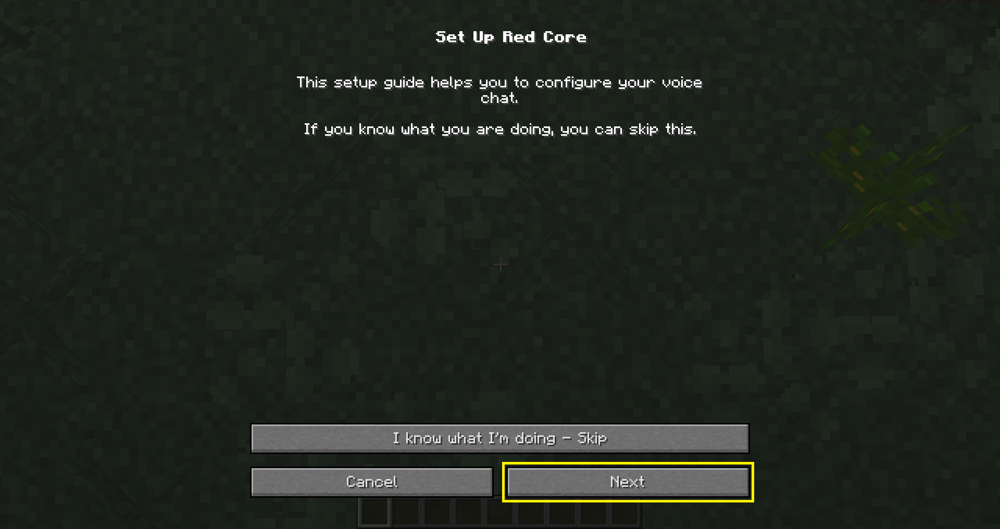

5. Sélectionnez votre microphone dans la liste, puis cliquez sur le bouton "Next".
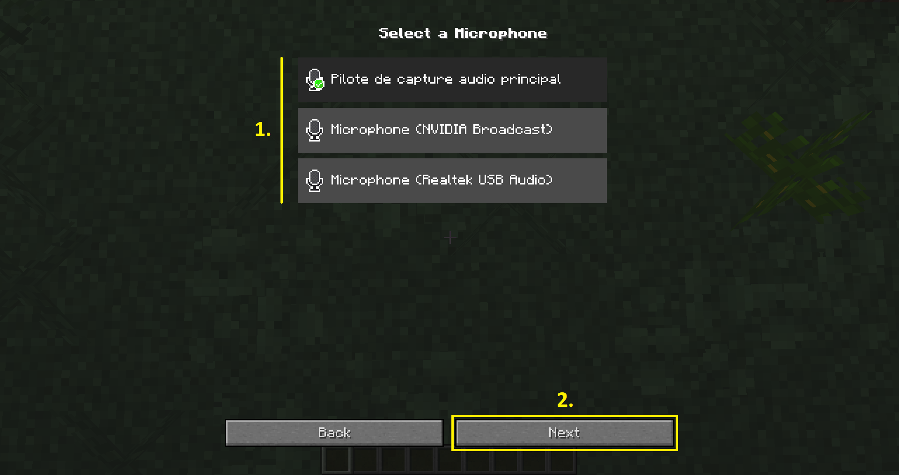

6. Sélectionnez votre casque ou vos haut-parleurs dans la liste, puis cliquez sur le bouton "Next".
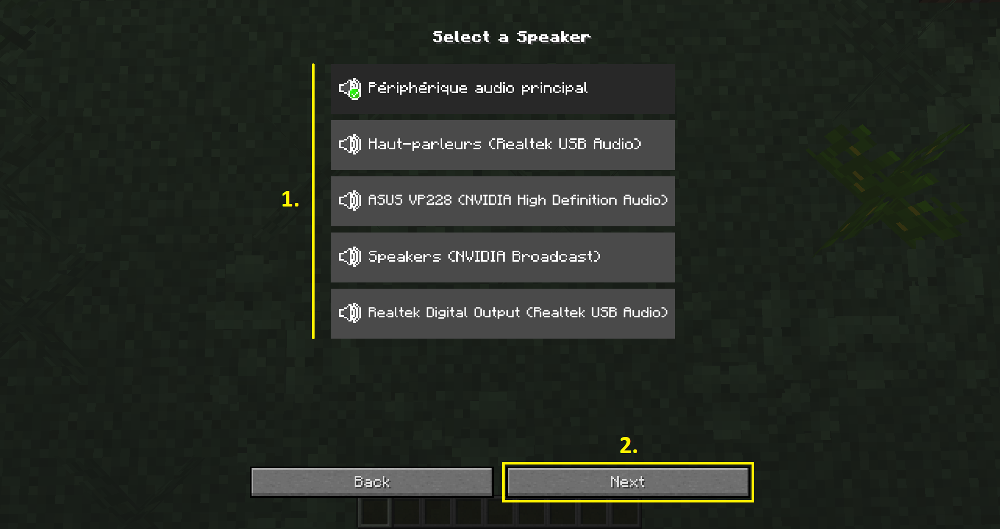

7. Sélectionnez l'un des 2 modes de détection de voix. Configurez la sensibilité du micro et l'amplification si besoin. Cliquez ensuite sur le bouton "Next".
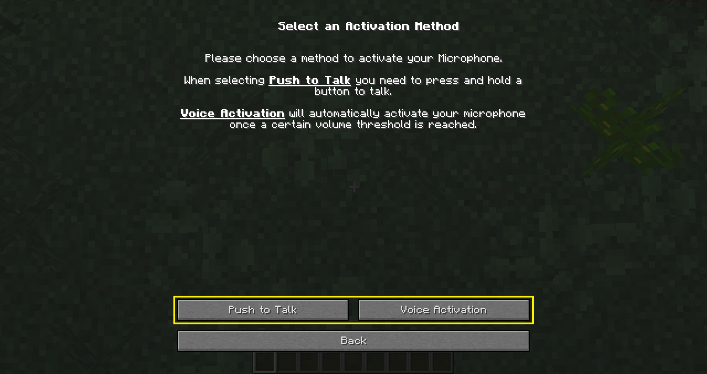

8. Terminez la configuration en cliquant sur le bouton "Finish setup".
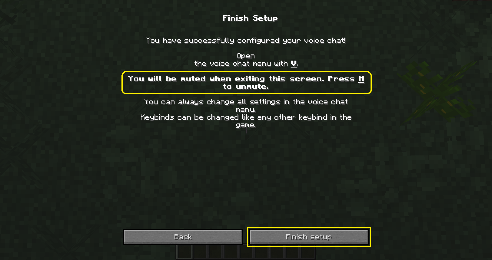

9. Une fois ces étapes terminées, appuyez de nouveau sur la touche que vous avez assignée pour ouvrir le menu GUI de Simple Voice Chat. Dé-mutez votre micro en cliquant sur le bouton "Mute".
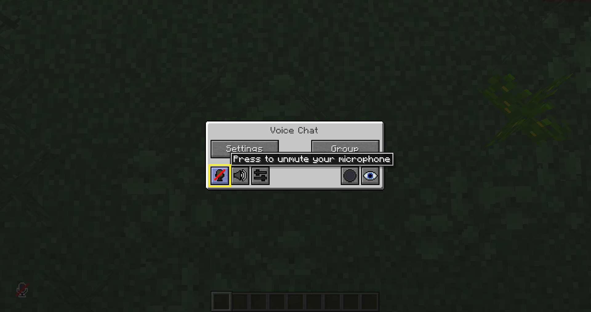

10. Félicitations, vous avez terminé de configurer Simple Voice Chat !

## Lancement de Project Gorgeous

Une fois toutes ces étapes réalisées, vous êtes fin prêt à jouer à Project Gorgeous !

Je n'ai plus qu'à vous souhaiter une excellente aventure sur Project Gorgeous ! Amusez-vous bien ! 🌟
