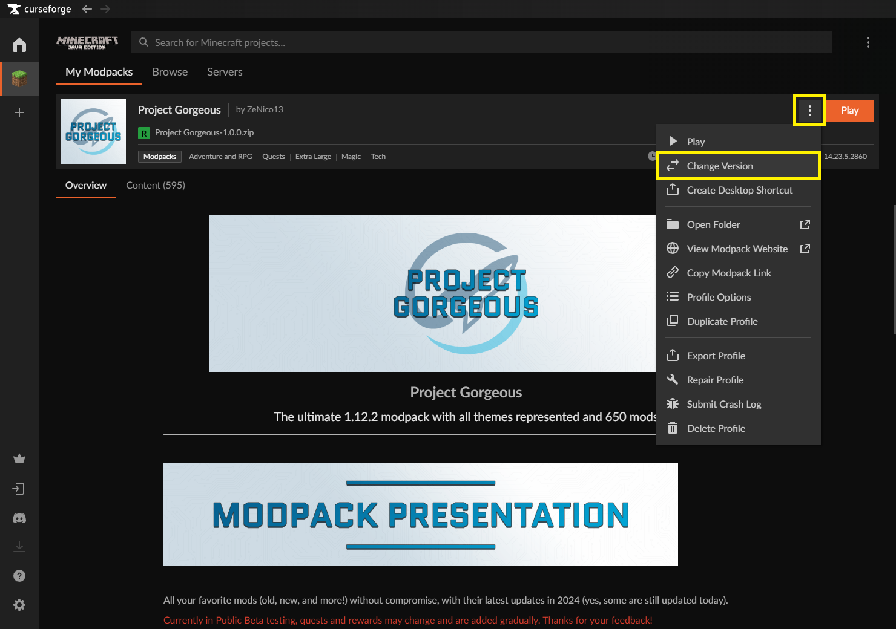
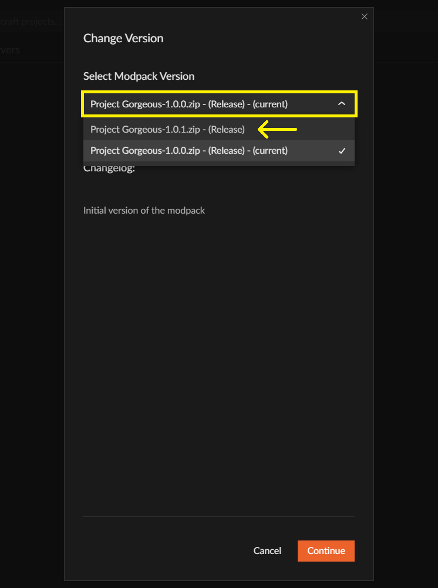
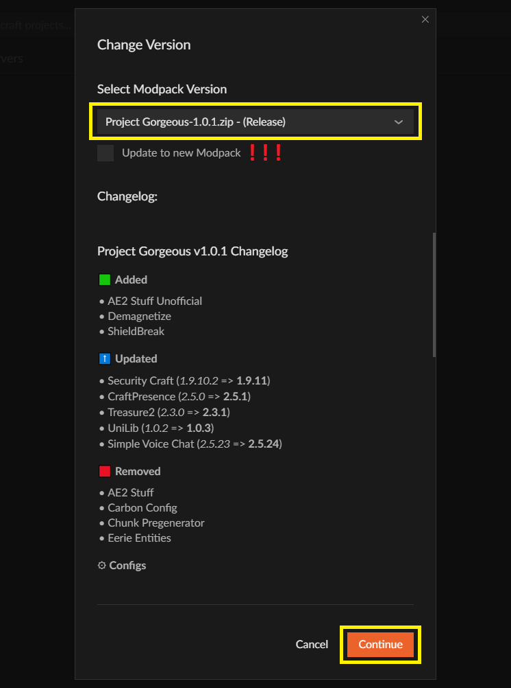
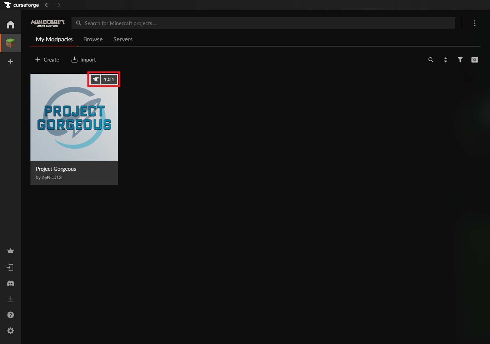

# Project Gorgeous Update Procedure (client) (English)

1. Open CurseForge and navigate to the "Minecraft" tab.

2. CurseForge should automatically detect any available updates when the application is launched. A "Change Version" button should appear next to the "Play" button when you hover over the modpack icon with your mouse. Click on it.

> ℹ️ **Note:** If the "Change Version" button does not appear automatically, open your "Project Gorgeous" profile, then click on the "3 small dots" icon located in the upper right corner, next to the "Play" button. In the dropdown list, click on "Change Version".

3. In the pop-up that appears, select the new version from the dropdown list.

4. **DO NOT CHECK** the "Update to new Modpack" box. You can read the changelog, then click the "Continue" button.

> ℹ️ **Note:** If you check the "Update to new Modpack" box, a new CurseForge profile will be created for the new version of the modpack you wish to install. You will then start with a completely fresh configuration, without your data. Note that CurseForge will NOT delete your old profile, and you will still have access to it!

5. Wait while the modpack is updated.

6. When the update is installed correctly, you should see the new modpack version number in the upper right corner of the modpack icon.

7. Congratulations, you have successfully updated Project Gorgeous!
