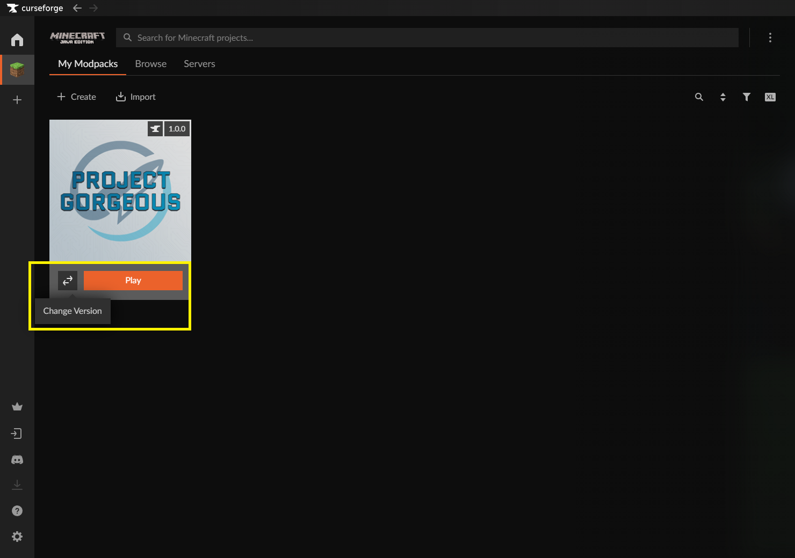
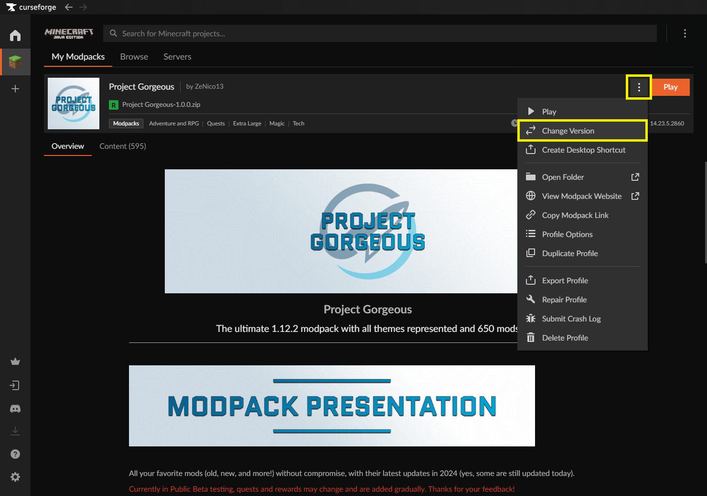
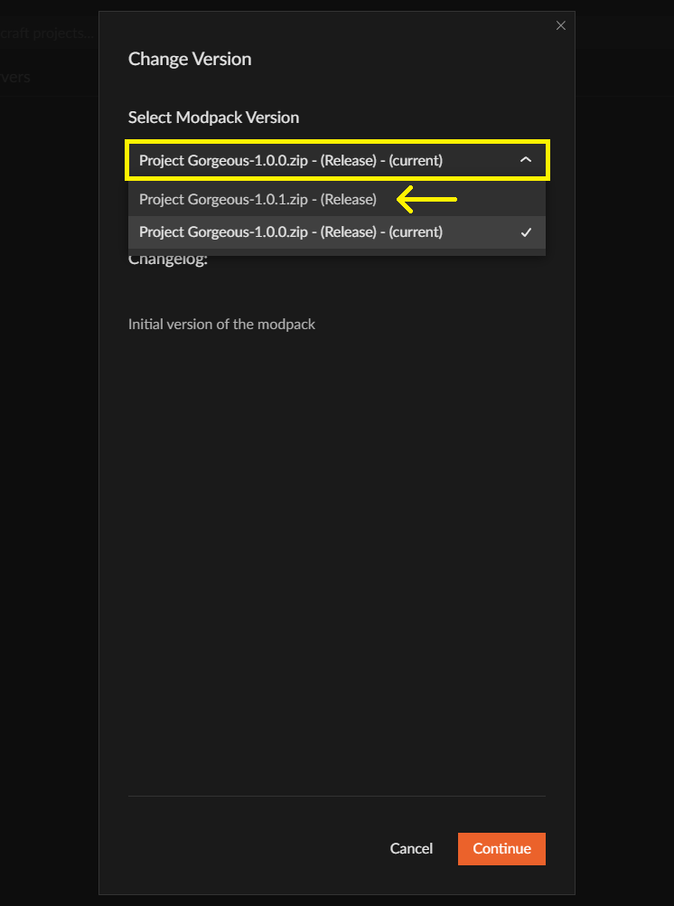
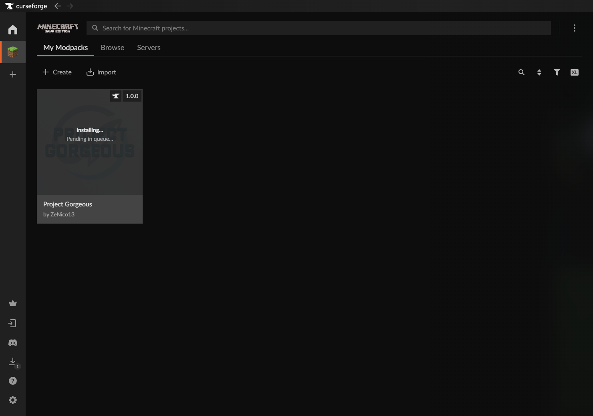
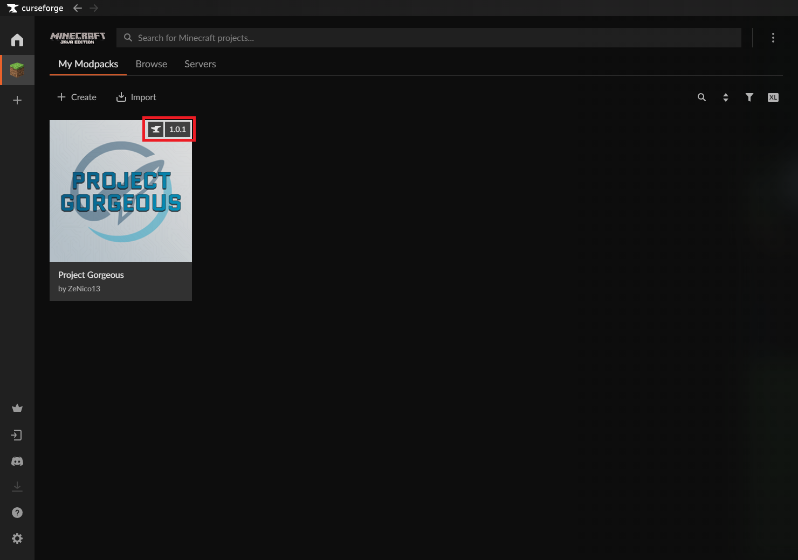

# Procédure de mise à jour de Project Gorgeous (client) (Français)

1. Ouvrez CurseForge et naviguez dans l'onglet "Minecraft".

2. CurseForge doit détecter automatiquement au lancement de l'application les nouvelles mises à jour disponibles. Un bouton "Change Version" doit apparaitre à côté du bouton "Play", lorsque vous survolez l'icône du modpack avec votre souris. Cliquez dessus.

> ℹ️ **Note :** Si le bouton "Change Version" ne s'affiche pas automatiquement, ouvrez votre profil "Project Gorgeous", puis cliquez sur l'icône "3 petits points" qui se situe en haut à droite, à côté du bouton "Play". Dans la liste déroulante, cliquez sur "Change Version".

3. Dans la pop-up qui s'affiche, sélectionnez la nouvelle version dans la liste déroulante.

4. **NE COCHEZ PAS** la case "Update to new Modpack". Vous pouvez lire le changelog, puis cliquer sur le bouton "Continue".

> ℹ️ **Note :** Si vous cochez la case "Update to new Modpack", un nouveau profil CurseForge sera créé pour la nouvelle version du modpack que vous souhaitez installer. Vous repartirez alors sur une configuration totalement vierge, sans vos données. A noter que CurseForge ne supprime PAS votre ancien profil et vous pourrez toujours y accéder !

5. Patientez pendant la mise à jour du modpack.

6. Quand la mise à jour est installée correctement, vous devez voir le nouveau numéro de version du modpack dans le coin supérieur droit de l'icône du modpack.

7. Bravo, vous avez mis à jour Project Gorgeous !
